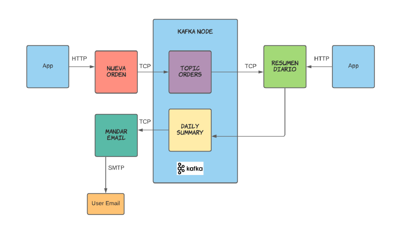
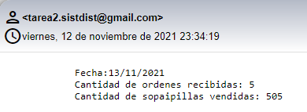

# distributed-systems-kafka

## Descripción de la tarea

Esta tarea tiene como objetivo aprevechar la tecnologia de **Apache Kafka** en una aplicación de Python. Siguiendo la figura, la tarea se dividió en dos aplicaciones de Python, uno encargado de recibir peticiones como API REST y el otro encargado de enviar correos cuando corresponda.



## Aplicaciones

El codigo de las aplicaciones se encuentran en la carpeta `src`.

### API REST

El archivo `api_rest.py` corresponde a la API REST programada con el framework de Flask, esta recibe peticiones a las siguiente rutas:

* **/newOrder**: Esta ruta recibe peticiones con el metodo POST con un JSON que contiene los datos relevantes de una nueva orden, esta orden es enviada a Apache Kafka y es guardado en el topico `order`:


* **/dailySummary**: Esta ruta recibe peticiones con el metodo POST y se encarga de consumir todas las ordenes del topico `order` hasta el momento y genera un resumen de estas ordenes. El resumen es almacenado en el topico `summary` en formato JSON. Ejemplo de un resumen:
```json
// Resumen de ordenes diarias en el topico "summary"
{
    "ventas": {
        "vendor2_tarea2@yopmail.com": {
            "n_sopaipillas": 101,
            "n_ordenes": 1
        }, 
        "vendor_tarea2@yopmail.com": {
            "n_sopaipillas": 101,
            "n_ordenes": 1
        }
    }, 
    "fecha": "13/11/2021"
}
```
### Mandar Email
El archivo `send_mail.py` correponde a la aplicación encargada de consomir del topico `summary` para luego enviar un correo. El correo recibido tiene el siguiente formato:



## Configuración y ejecución

### 
Los topicos utilizados en Apache Kafka son `order` y `summary`, por lo que se utilizó el comando *bash* para poder crearlos. El archivo se encuentra en `kafka/create-topics.sh`.

```bash
# $KAFKA corresponde a la ruta en la que se encuentra Apache Kafka

$KAFKA/bin/kafka-topics.sh --create \
    --bootstrap-server localhost:9092 \
    --replication-factor 1 \
    --partitions 1 \
    --config retention.ms=259200000 \
    --topic order

$KAFKA/bin/kafka-topics.sh --create \
    --bootstrap-server localhost:9092 \
    --replication-factor 1 \
    --partitions 1 \
    --config retention.ms=259200000 \
    --topic summary
```

### Dependencias de Python

Las dependencias necesarias para que se pueda ejecutar el programa se encuentran en el archivo `requirements.txt`.

### Ejecución

Con las dependencias instaladas se deben ejecutar los archivos `api_rest.py` y `send_mail.py`.

#### Generar una nueva orden

Para generar una nueva orden debe realizar una petición a la siguiente ruta `localhost:5000/newOrder`. Esta petición debe ser con el metodo POST y el cuerpo debe tener un JSON que por lo menos tenga los siguientes campos:

```json
// Petición POST con el siguiente JSON
{
    "order_id": 3,
    "email_vendedor": "vendor_tarea2@yopmail.com",
    "email_cocinero": "asdasdasda@yopmail.com",
    "numero_sopaipillas": 15
}
```
Si la petición se realizo correctamente se respondera con un JSON confirmando que se genero correctamente la orden.

#### Generar el resumen diario

Para generar el resumen diario se debe realizar una petición a `localhost:5000/dailySummary` con el metodo POST.
Si la petición se realizo correctamente se respondera con un JSON confirmando que se genero correctamente el resumen diario.

#### Enviar correo

Si existen ventas registradas en el resumen diario, se enviara un correo a su respectivo vendedor. Este correo se envia desde una direccion de google creada para esta ocasion.

## Integrantes:
* Ariel Gómez
* Pablo Muñoz
* Víctor Sánchez
